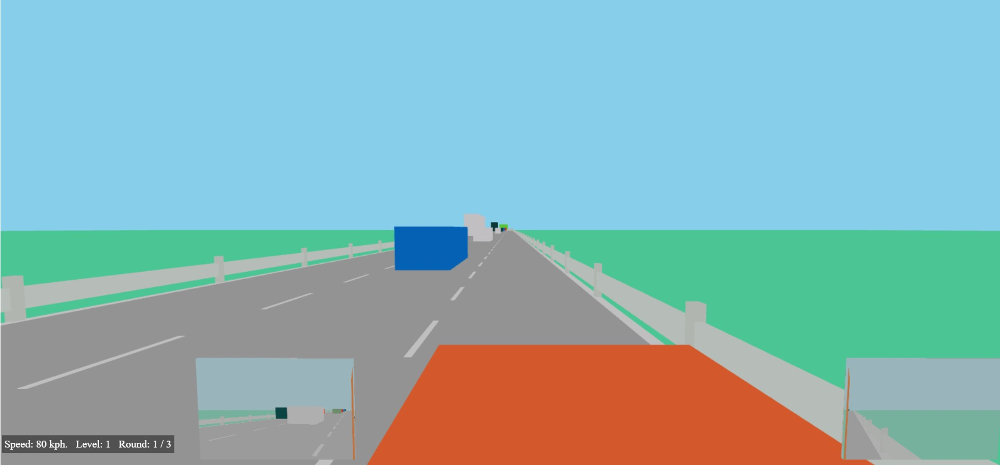

# Lane Merging Simulator  

A simple 3D lane merging simulator. After several near-death experiences while teaching
my wife how to merge onto a motorway, I decided to create this simulator to help her learn. I aimed to use
realistic parameters to mimic real-world car acceleration and braking.  Keep in mind that the
graphics are very simplistic. 

🎮 **[Try it yourself](https://tomash1234.github.io/lane-merge-sim/)**  

## 🕹️ Controls  

- **W / S / A / D** - Car movement (W = accelerate, S = brake, A = steer left, D = steer right)  
- **P** - Pause / resume  
- **R** - Restart  

## 🏁 Levels  

- Currently, there are **10 levels**.  
- To advance to the next level, you must successfully merge **three times in a row**.  
- If you crash, your streak counter resets.

## Feedback

- Feel free create an issue with feedback
- Nice comments will encourage to expanse this project :)